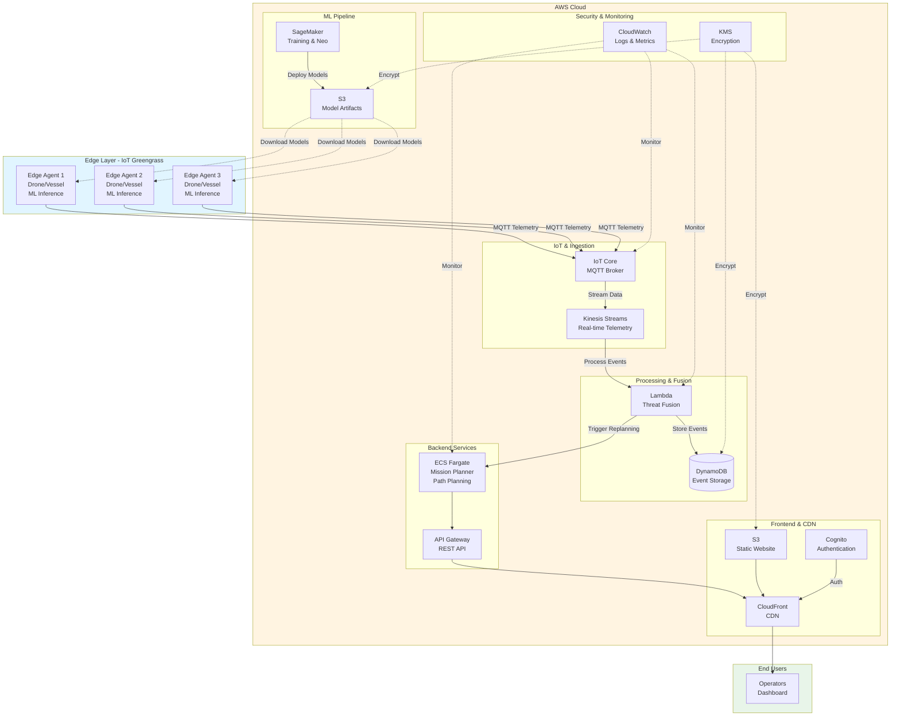

# Maritime ACPS - AWS Architecture Diagram

## Architecture Overview

This document provides the AWS architecture for the Maritime Autonomous Convoy Protection System (ACPS).

## Mermaid Diagram

## Component Details

### 1. Edge Layer (IoT Greengrass)
- **IoT Greengrass v2**: Edge runtime for local ML inference
- **Edge Agents**: Deployed on drones/vessels with sensors
- **Local ML Models**: SageMaker Neo optimized models
- **Sensors**: Camera, radar, acoustic, RF sensors
- **Local Processing**: <100ms inference latency

### 2. IoT & Data Ingestion
- **AWS IoT Core**: MQTT broker for device connectivity
- **IoT Rules**: Route telemetry to Kinesis
- **Kinesis Data Streams**: Real-time data ingestion
- **Device Management**: Certificate-based authentication

### 3. Processing & Fusion
- **Lambda Functions**: 
  - Threat fusion from multiple sensors
  - Event processing and enrichment
  - Alert generation
- **DynamoDB**: 
  - Event storage with TTL
  - Threat history and tracking
  - Query patterns for dashboard

### 4. ML Pipeline
- **SageMaker Training**: PyTorch threat detection models
- **SageMaker Processing**: Synthetic data generation
- **SageMaker Neo**: Edge optimization for ARM/Jetson
- **S3 Model Registry**: Versioned model artifacts
- **Model Deployment**: Automated to edge devices

### 5. Backend Services
- **ECS Fargate**: 
  - Mission planner service
  - A* path planning with threat avoidance
  - Multi-route optimization
- **API Gateway**: 
  - REST API for dashboard
  - WebSocket for real-time updates
- **Auto-scaling**: Based on threat levels

### 6. Frontend & CDN
- **CloudFront**: Global CDN for low latency
- **S3 Static Hosting**: React dashboard
- **Cognito**: User authentication and authorization
- **WebSocket**: Real-time convoy tracking

### 7. Security & Monitoring
- **KMS**: Encryption at rest for all data stores
- **IAM**: Least privilege access policies
- **CloudWatch**: 
  - Logs aggregation
  - Metrics and alarms
  - Dashboard monitoring
- **VPC**: Private subnets for backend services

## Data Flow

1. **Edge Detection** (0-100ms):
   - Sensors capture maritime data
   - Local ML inference on Greengrass
   - Threat classification and scoring

2. **Cloud Ingestion** (100-500ms):
   - MQTT publish to IoT Core
   - IoT Rules route to Kinesis
   - Stream processing begins

3. **Threat Fusion** (500ms-2s):
   - Lambda processes multi-sensor data
   - Correlation and fusion algorithms
   - Store events in DynamoDB

4. **Mission Planning** (2-5s):
   - ECS service receives threat updates
   - A* path planning with threat avoidance
   - Generate alternative routes

5. **Dashboard Update** (5-10s):
   - WebSocket push to connected clients
   - Real-time map visualization
   - Alert notifications

## AWS Services Used

| Service | Purpose | Configuration |
|---------|---------|---------------|
| IoT Core | Device connectivity | MQTT, X.509 certs |
| IoT Greengrass | Edge runtime | v2, ML components |
| Kinesis Streams | Data ingestion | 2 shards, 24h retention |
| Lambda | Event processing | Python 3.11, 512MB |
| DynamoDB | Event storage | On-demand, TTL enabled |
| SageMaker | ML training | ml.p3.2xlarge (training) |
| SageMaker Neo | Edge optimization | ARM64, Jetson targets |
| ECS Fargate | Backend services | 2 vCPU, 4GB RAM |
| API Gateway | REST/WebSocket | Regional endpoint |
| S3 | Storage | Versioning, encryption |
| CloudFront | CDN | HTTPS only |
| Cognito | Authentication | User pools |
| KMS | Encryption | Customer managed keys |
| CloudWatch | Monitoring | 7-day log retention |
| VPC | Networking | Private subnets, NAT |

## Deployment Regions

- **Primary**: us-east-1 (N. Virginia)
- **Secondary**: eu-west-1 (Ireland) for international ops

## Cost Optimization

- Spot instances for SageMaker training
- S3 lifecycle policies (Glacier after 90 days)
- DynamoDB on-demand billing
- CloudWatch log retention limits
- Auto-scaling based on load

## Security Best Practices

✅ Encryption at rest (KMS)
✅ Encryption in transit (TLS 1.2+)
✅ Least privilege IAM policies
✅ VPC isolation for backend
✅ Certificate-based device auth
✅ Cognito MFA for operators
✅ CloudTrail audit logging
✅ Security group restrictions

## Performance Targets

- Edge inference: <100ms
- Cloud fusion: <5s end-to-end
- Dashboard updates: <10s
- Path replanning: <30s
- System availability: 99.9%

## Human-in-the-Loop Safety

⚠️ **CRITICAL**: All engagement decisions require human authorization
- System provides recommendations only
- Defensive operations only
- Explicit operator approval required
- Full audit trail maintained

## How to Deploy

See [deploy_instructions.md](deploy_instructions.md) for step-by-step deployment guide.

## Monitoring Dashboard

Key metrics to monitor:
- Device connectivity status
- Inference latency (edge)
- Kinesis throughput
- Lambda error rates
- DynamoDB read/write capacity
- ECS service health
- API Gateway latency
- CloudFront cache hit ratio
