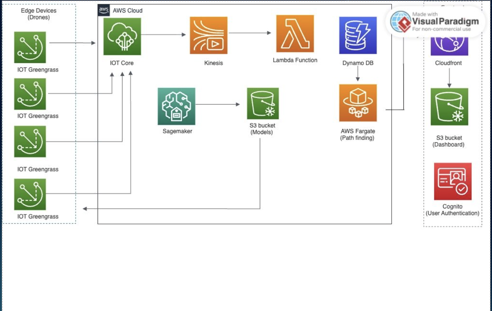

<h1 align="center">
  
  <br>
  <i>Hybrid, Ultra-silent, Self-Healing Drone Mesh</i>
</h1>

<p align="center">
  <a href="https://www.python.org/" target="_blank"></a>
  <a href="https://flask.palletsprojects.com/" target="_blank"></a>
  <a href="https://pytorch.org/" target="_blank"></a>
  <a href="https://aws.amazon.com/" target="_blank"></a>
  <a href="https://mqtt.org/" target="_blank"></a>
</p>

<h1 align="center">
    
</h1>

# Overview

HUSH-MESH is an AWS-first maritime threat detection and convoy protection system leveraging machine learning, edge computing, and real-time path planning. The system deploys autonomous drone networks for defensive surveillance and threat assessment in maritime environments.

**Key Capabilities**: Real-time threat detection • Multi-sensor fusion • Edge ML inference • Self-healing mesh networks • Dynamic route optimization

---

## Quick Start

### Prerequisites

Ensure you have Python 3.9+ installed:

```bash
python3 --version
```

Install required dependencies:

```bash
pip install flask flask-cors fastapi uvicorn paho-mqtt torch numpy
```

### Starting the System

#### 1. Reset Any Existing Processes

```bash
pkill -f "python.*server" && pkill -f "python.*app" && pkill -f "http.server"
```

#### 2. Start ML API Server (Port 9000)

```bash
cd ml
export PYTHONPATH=/home/participant/.local/lib/python3.11/site-packages:$PYTHONPATH
python3 ml_api_server.py > /tmp/ml_server.log 2>&1 &
```

#### 3. Start Demo Server (Port 8081)

```bash
cd demo
python3 -m http.server 8081 > /tmp/demo_server.log 2>&1 &
```

### Verify System Status

Check that all servers are running:

```bash
# Check ML API Server
curl http://localhost:9000/health

# Check Demo Server
curl http://localhost:8081/

# View server logs
tail -f /tmp/ml_server.log
tail -f /tmp/demo_server.log
```

---

## Access Points

### Interactive Demos

- **Enhanced Multi-Route Demo**: http://localhost:8081/enhanced_multi_route.html
- **ML Test Interface**: http://localhost:8081/test_ml.html

### API Endpoints

#### ML API Server (Port 9000)
- `GET /health` – Health check and server status
- `POST /predict` – Threat prediction inference
- `POST /reset` – Reset model state

#### Demo Server (Port 8081)
- Serves static HTML demos and visualizations

---

## System Architecture

```
┌─────────────────┐    ┌─────────────────┐    ┌─────────────────┐
│   Edge Layer    │    │   Cloud Layer   │    │  Dashboard UI   │
│                 │    │                 │    │                 │
│ • Greengrass    │◄──►│ • IoT Core      │◄──►│ • React App     │
│ • ML Models     │    │ • Kinesis       │    │ • Real-time Map │
│ • Sensors       │    │ • Lambda        │    │ • WebSocket     │
│ • MQTT Comms    │    │ • DynamoDB      │    │ • Cognito       │
└─────────────────┘    └─────────────────┘    └─────────────────┘
```

**Core Technologies**:
- **Edge Computing**: AWS IoT Greengrass + SageMaker Neo optimized models
- **Cloud Infrastructure**: Kinesis Streams + Lambda + DynamoDB + ECS Fargate
- **ML Pipeline**: SageMaker training with maritime threat detection models
- **Communication**: MQTT mesh networking for resilient edge coordination

---

## Development Workflow

### Running Tests

```bash
# Test ML inference
python3 test_ml_integration.py

# Test convoy simulation
python3 simple_demo.py
```

### Monitoring Logs

```bash
# Monitor ML server
tail -f /tmp/ml_server.log

# Monitor demo server
tail -f /tmp/demo_server.log

# Check for errors
grep -i error /tmp/ml_server.log
```

### Troubleshooting

#### Servers Won't Start

```bash
# Check port availability
netstat -tlnp | grep -E ":(8081|9000)"

# Force kill and restart
pkill -9 -f "python.*server"
pkill -9 -f "http.server"

# Restart servers (run commands from steps 2-3 above)
```

#### ML Model Issues

```bash
# Verify model file exists
ls -lh models/model.pth

# Check Python path
echo $PYTHONPATH

# Reinstall dependencies
pip install --force-reinstall torch numpy
```

#### Connection Refused Errors

Ensure all servers are running and listening on correct ports:

```bash
ps aux | grep python
netstat -tlnp | grep LISTEN
```

---

## Deployment to AWS

For production deployment with full AWS integration:

1. Configure AWS CLI with appropriate credentials
2. Deploy infrastructure using CDK/CloudFormation
3. Set up IoT Greengrass on edge devices
4. Deploy ML models to SageMaker endpoints
5. Configure Kinesis streams for telemetry ingestion

See `docs/deploy_instructions.md` for comprehensive deployment guide.

---

## Project Structure

```
hush-mesh/
├── ml/                     # ML inference server
│   ├── ml_api_server.py   # Flask API for threat detection
│   └── models/            # Trained PyTorch models
├── demo/                   # HTML demos and visualizations
│   ├── enhanced_multi_route.html
│   └── test_ml.html
├── backend/               # Backend API server (optional)
├── docs/                  # Documentation
│   ├── architecture.md
│   └── deploy_instructions.md
└── README.md
```

---

## Security & Ethics

**Human-in-the-Loop Design**: All engagement decisions require explicit human authorization. The system provides threat assessment and recommendations only.

**Defensive Posture**: System is designed exclusively for defensive maritime convoy protection. No autonomous offensive capabilities.

**Data Privacy**: Synthetic training data only. No PII collection. All telemetry encrypted in transit and at rest.

---

## License

[MIT License](./LICENSE)

---

**Developed for**: AWS Mission Autonomy Hackathon Fall 2025  
**Team**: Clankers
**Status**: Active Development – MVP Complete
